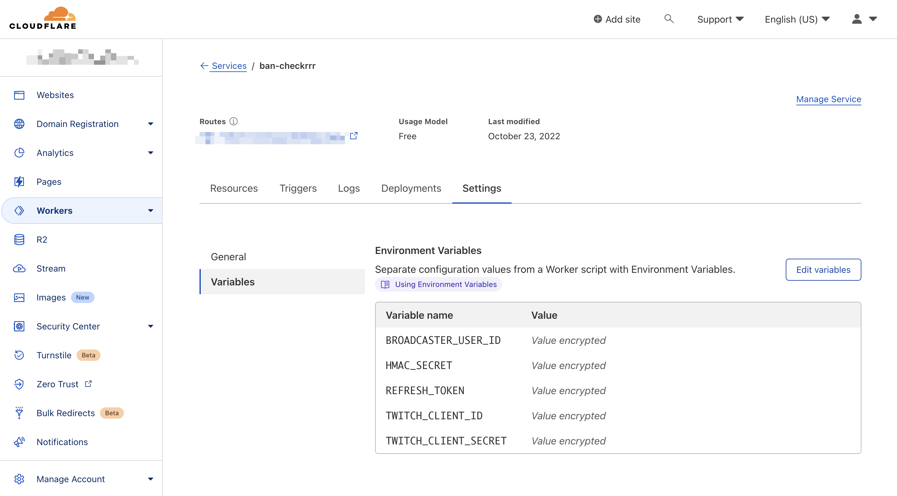

# Ban Checkrrr

**Ban Checkrrr** is a tool streamers can use to find out if a user is on their Twitch ban list. 

This tool was made to make checking your ban list simpler so that streamers can set it up and use it as a source of ban list information for their various bots and software without needing to worry about the overhead of managing Twitch auth tokens.

This solution is tightly-coupled to the Cloudflare platform. It deploys to Cloudflare Workers and can be used within their [generous free tier](https://developers.cloudflare.com/workers/platform/pricing).

You can learn more about the motivations for this project on [my blog](https://blog.techygrrrl.stream).

- [Using this Code](#using-this-code)
- [Setup on Twitch](#setup-on-twitch)
  - [Register an application with Twitch](#register-an-application-with-twitch)
  - [Creating access tokens with Twitch CLI](#creating-access-tokens-with-twitch-cli)
- [Setup on Cloudflare](#setup-on-cloudflare)
  - [Create a `wrangler.toml` file](#create-a-wranglertoml-file)
  - [Create your KV Namespaces](#create-your-kv-namespaces)
  - [Setting environment secrets](#setting-environment-secrets)
    - [Twitch Client ID](#twitch-client-id)
    - [Twitch Client Secret](#twitch-client-secret)
    - [Refresh token](#refresh-token)
    - [Broadcaster User ID](#broadcaster-user-id)
    - [HMAC secret](#hmac-secret)
      - [Generating a secure string with Ruby or Python](#generating-a-secure-string-with-ruby-or-python)
  - [Storing your current access token in KV Namespaces](#storing-your-current-access-token-in-kv-namespaces)
- [Usage](#usage)
  - [Request `GET /`](#request-get-)
    - [Authentication](#authentication)
    - [Payload](#payload)
    - [Example Request](#example-request)
    - [Response](#response)
    - [Errors](#errors)
- [Contributing to this project](#contributing-to-this-project)


## Using this Code

If you would like to use the code as-is, you can click the "Use this template" button.

If you would like to contribute to the project, it's recommended to fork it so you can contribute changes to the upstream repository. 

You can also do both.


## Setup on Twitch

In order to use this, you will need to register an application in the Twitch Developer console and use the [Twitch CLI](https://dev.twitch.tv/docs/cli/token-command) to generate a user access token and refresh token for you for that application.

### Register an application with Twitch

Follow the instructions in the official Twitch documentation for how to register an application: https://dev.twitch.tv/docs/authentication/register-app

It will need to be an application not an extension.

### Creating access tokens with Twitch CLI

You'll need to create an access token with the following scopes:

-   `moderation:read`

Run the following command in the terminal after having installed the Twitch CLI:

    twitch configure

Input the request client ID and client secret for the application you just registered.

Then run the following command to generate a token with the required scopes:

    twitch token -u -s 'moderation:read'

This will output a user access token and a refresh token to your console. **Do not share either as these are sensitive**.


## Setup on Cloudflare

You will need to create a Cloudflare account and sign up for their free tier, which does not require a credit card.

You will need to set up a Cloudflare Worker function, a KV namespace, and environment secrets. All this will be explained below and can be done with the `wrangler` CLI, which is an NPM package you can use by calling `npx wrangler <command>`. This first time you run `npx wrangler`, NPM will prompt you to install it globally. The easiest option is to say yes and use it with the `npx` prefix.

Here are some references for further reading:

- [Wrangler CLI documentation](https://developers.cloudflare.com/workers/wrangler/) – you should scan this or the `--help` output to be familiar with how to use the CLI
    - [Logging into Wrangler](https://developers.cloudflare.com/workers/wrangler/commands/#login) – you'll need to do this before running commands
-   [Overview of Cloudflare Workers](https://developers.cloudflare.com/workers/)
-   [KV Namespaces](https://developers.cloudflare.com/workers/runtime-apis/kv/)
-   [How KV works](https://developers.cloudflare.com/workers/learning/how-kv-works)


### Create a `wrangler.toml` file

Wrangler's configuration file is the `wrangler.toml` file. An example has been created. Run the following to copy it:

    cp wrangler.toml.example wrangler.toml


### Create your KV Namespaces

For KV Namespaces, Cloudflare enforces that you do not use the production key-value store during development. For that reason, we have both `id` and `preview_id` in the `wrangler.toml` file.

We will need to create 2 separate namespaces and managing key/value pairs for b oth.

Create your production namespace:

    npx wrangler kv:namespace create BAN_CHECKRRR_PRODUCTION

Create your development (or preview) namespace:

    npx wrangler kv:namespace create BAN_CHECKRRR_DEVELOPMENT

After each namespace is created, put its `id` in the `wrangler.toml` file.

You can see all your namespaces created under your account with the following command:

    npx wrangler kv:namespace list

If you are not planning on contributing to the project, you may not need to run your project locally and can potentially get away with only a single KV Namespace.

### Setting environment secrets

You will need to run the following lines, one at a time, and paste the credential when prompted.

When you're done, your dashboard should look like this (all of the secrets configured).




#### Twitch Client ID

This is generated by Twitch and can be found in the Twitch developer dashboard under your application.

    npx wrangler secret put TWITCH_CLIENT_ID

#### Twitch Client Secret 

This is generated by Twitch and can be found in the Twitch developer dashboard under your application.

**This will only be shown once and will need to be regenerated if you do not retain a copy of this. It is sensitive.**

    npx wrangler secret put TWITCH_CLIENT_SECRET


#### Refresh token

    npx wrangler secret put REFRESH_TOKEN


#### Broadcaster User ID

This is the streamer's user ID and must also be the owner of the access token and refresh token:

    npx wrangler secret put BROADCASTER_USER_ID


#### HMAC secret

This is a securely random-generated string.

    npx wrangler secret put HMAC_SECRET


##### Generating a secure string with Ruby or Python

If you have Ruby on your machine, you can run `irb` to enter the REPL, and then run the following in the REPL:

```rb
require 'securerandom'

SecureRandom.hex(32)
```

You can also use Python to generate random strings. I made [these aliases](https://gist.github.com/techygrrrl/87ee025fd05f930c4ec475734c11229c) to help with that. 


### Storing your current access token in KV Namespaces

You can do so with the following command:

    npx wrangler kv:key put access_token <YOUR_ACCESS_TOKEN> --namespace-id <YOUR_NAMESPACE_ID>

If you are running it locally in development, you will need to create a preview namespace as described above and add it to both the preview and production namespaces.


## Usage

Once the app is running and deployed, you can communicate with it using the HMAC secret.

### Request `GET /`

#### Authentication

A request header that looks like this:

-   key: `Authorization`
-   value: `Bearer HMAC_SECRET`

Where `HMAC_SECRET` is the above-mentioned generated secret.

#### Payload

| Query Parameter | Description                                                       |
| --------------- | ----------------------------------------------------------------- |
| `user_id`       | The user ID of the user to check is on the broadcaster's ban list |

#### Example Request

You would make a request as follows:

```sh
curl https://ban-checkrrr.<your-username>.workers.dev/?user_id=123456 -H 'Authorization: Bearer HMAC_SECRET'
```

#### Response

The response is JSON with the following properties:

| Property    | Type    | Description                                                          |
| ----------- | ------- | -------------------------------------------------------------------- |
| `is_banned` | Boolean | Whether the user has been banned or not in the broadcaster's channel |

Example response:

```json
{
    "is_banned": false
}
```

#### Errors

- `400` when the required `user_id` query parameter is not provided
- `401` when the HMAC token is not provided or is incorrect
- `403` when the access token and refresh token have been revoked
- `500` when an unknown error has occured, e.g. misconfiguration of the server, or another unexpected error

## Contributing to this project

Please check the [CONTRIBUTING](CONTRIBUTING.md) doc for more information before creating a pull request.
